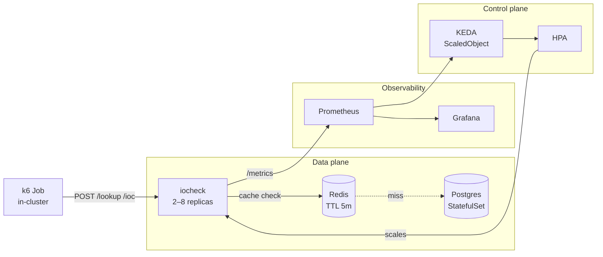
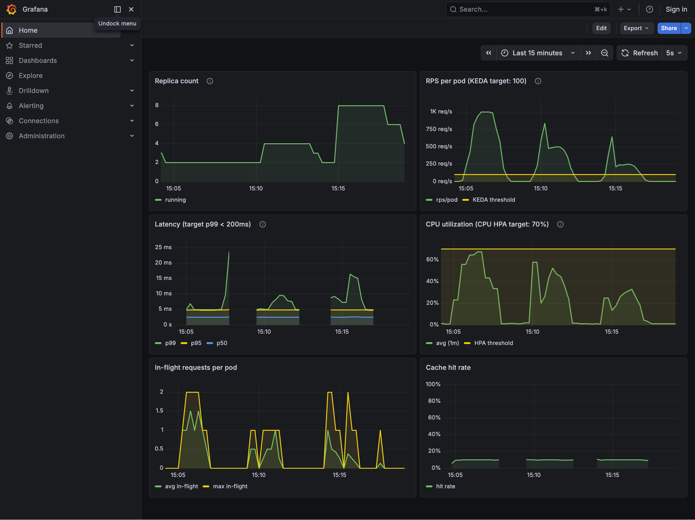

# iocheck Writeup

A backend service for SOC analysts to check whether an IOC (IP / domain / sha256)
is known-malicious.

All measured numbers in this document are from runs on a local 4-node `kind` cluster (1 control-plane + 3 workers) on a single macOS host.

This exercise was completed with the assistance of Claude (Opus 4.7).

Claude's assistance took the following forms:

- Parsing the problem statement: working through the brief, decoding requirements, and surfacing assumptions worth clarifying.
- Teaching mode: Q&A and ELI5 explanations to build intuition for concepts like KEDA, Prometheus, and Little's Law.
- Researching prior art: looking for precedents (Knative concurrency, Zalando's autoscaler) and suggesting sane defaults.
- Scaffolding the implementation: drafting code, manifests, and configuration via Claude Code.

In general, the AI is used to close knowledge gaps and iterate fast while I still maintain decision agency.

# Assumptions

The brief leaves several open decisions. In general, when faced with ambiguity, I picked the options that have strong _prior precedence_ i.e. recommended defaults by the tooling docs or real-world constraints i.e. my local environment. The following are non-exhaustive:

| Assumption | Detail |
|---|---|
| Verdict semantics | Row in `iocs` ⇒ `"malicious"`, absence ⇒ `"unknown"`. `score` is metadata, not a threshold. |
| IOC lifetime | Immortal. Cache TTL (5 min hit / 60 s miss) is a freshness-vs-cost knob, not a staleness SLA. |
| Cache ephemerality | Redis `--save "" --appendonly no`, `allkeys-lru` at 256 MB. Restart = cold cache; LRU can preempt TTL. |
| Write pattern | Low-rate via `POST /ioc`. No batch ingestion. |
| Auth posture | `POST /ioc` needs `X-Admin-Token`; `/lookup` open. Service is NodePort (kind host `:8080`); no Ingress, no mTLS. |
| Sizing target | Interpreting the brief's qualitative "alert storms = ~10× RPS spikes" as ~1000 RPS sustained with ~10× burst on laptop kind. Tests autoscaler _behavior_, not raw throughput. |
| Burst shape | Benches default `MISS_RATE=0.8` (80% miss stress mix). Motivates the in-flight pivot in the future-work section. |
| Pool calibration | `PG_POOL_MAX=10/pod` × 8 = 80 conns vs Postgres `max_connections=200`. Headroom keeps scale-out from saturating the DB. |
| Autoscaler data source | Prometheus is chosen, not prescribed by the brief. The fallback story depends on this pick: a metrics-server or custom-adapter path would fail differently. |
| Load origin | Benches drive k6 as an in-cluster Job hitting ClusterIP. External clients via NodePort or Ingress would see different TCP-stickiness behavior; calibrations are in-cluster numbers. |

# Goals

| # | Goal | Type |
|---|---|---|
| 1 | Demonstrate why CPU-based HPA is the wrong signal for this workload, with measurements | Deliverable |
| 2 | Show load is spread evenly across replicas: no client stickiness, no hotspots | Deliverable |
| 3 | Scale up and down on real demand: first event seconds into a burst, return to floor minutes after it ends | Deliverable |
| 4 | Reproducible from a clean machine: `make up && make bench-*` with no manual steps | Deliverable |
| 5 | p99 < 200 ms under sustained load, post-scale-up stabilization (see SLO interpretation below) | Constraint |
| 6 | PDB `minAvailable: 2` holds through voluntary disruption | Constraint |
| 7 | Document and measure behavior when the autoscaler's data source is unavailable | Deliverable |
| - | Raw throughput records | Out of scope |
| - | Production-grade HA on dependencies (single-replica Postgres + Redis) | Out of scope |
| - | Ingress / auth hardening | Out of scope |
| - | Batch ingestion | Out of scope |

Out-of-scope items are flagged in the future-work section.

# Architecture

| Component | Pick | Why |
|---|---|---|
| Service runtime | Bun (`Bun.serve` directly, no router) | Fast TS-native runtime that bundles HTTP, SQL, Redis client, and a test runner. |
| Persistent store | Postgres | Composite-key relational lookup with schema-side CHECK constraints; beat Redis-only / KV on key shape and validation. |
| Cache | Redis | Read-through with negative tombstones; PG is the source of truth, cache reconstructible on cold start. |
| Cluster | kind | Multi-node enables pod anti-affinity → real load distribution across workers (Challenge #2). |
| Metrics TSDB | Prometheus (via kube-prometheus) | Industry-default TSDB and KEDA's most-supported scaler input. |
| Dashboards | Grafana | Bundled with kube-prometheus; anonymous Admin for demo only. |
| Autoscaler | KEDA (drives a generated HPA) | Plugs Prometheus into a managed HPA: non-CPU triggers + fallback behavior. |
| Load generator | k6 | Open-model `ramping-arrival-rate` executor: RPS is a fixed input, not gated by service throughput. |

### Why RPS as the scaling signal

You have to start from a defensible default; AI research surfaced two precedents:

- **In-flight / concurrency**: [Knative KPA](https://knative.dev/docs/serving/autoscaling/). Fits uniform per-request cost (serverless).
- **RPS**: [Zalando's `kube-metrics-adapter`](https://github.com/zalando-incubator/kube-metrics-adapter). Built for cache-fronted HTTP at scale.

iocheck is Zalando's shape (stateless, cache-fronted), and RPS is operationally legible: every dashboard and load-test tool speaks it. **RPS becomes the default benchmark**: CPU is the wrong-answer comparison, in-flight is the next-step extension. Target **100 RPS/pod**.

CPU is dismissed structurally: per-request CPU on a cache-fronted Bun service is dominated by JSON parse + Redis I/O wait, not arrival rate. Confirmed empirically under load.

### SLO interpretation

`p99 < 200 ms` is read as post-stabilization steady state, not strict throughout. Scale-up takes ~60–90 s and p99 spikes briefly while the in-flight queue drains; the SLO holds once the HPA settles, plus zero error rate. Measured runs landed p99 < 20 ms: the bottleneck was the autoscaler signal, not the service.

---

## 2. API (as built)

All shapes match `EXERCISE.md`. Verdict rule: a row in `iocs` ⇒ `"malicious"`, absence ⇒ `"unknown"`. `score` is metadata, not a threshold: the brief leaves the rule undefined, so the simplest interpretation wins.

| Route | Method | Auth | Behavior |
|---|---|---|---|
| `/lookup` | POST | - | `{type, value}` → `{verdict, ioc?}`. Validates `type ∈ {ip, domain, sha256}` + non-empty `value`. Read-through cache. |
| `/ioc` | POST | `X-Admin-Token` (401 on mismatch) | `{type, value, source, score}` → 201. Validates `score ∈ [0, 100]`. Cache `DEL` after upsert returns. |
| `/healthz` | GET | - | Always 200 while the process is running. Liveness probe; never reaches DB/cache. |
| `/readyz` | GET | - | 200 only when both Postgres and Redis answer; result cached 1 s. Returns 503 during SIGTERM drain so kube-proxy de-registers before in-flight is interrupted. Also wired as the startup probe (30 s cold-pod grace). |
| `/metrics` | GET | - | Prometheus exposition. Custom series: `http_requests_total`, `http_request_duration_seconds`, `cache_lookups_total{result}`, `db_queries_total`, `iocheck_inflight_requests`. `prom-client`'s `collectDefaultMetrics()` is _not_ called, crashes Bun via `perf_hooks.monitorEventLoopDelay` (oven-sh/bun#18300). |

---

## 3. Resources & budgets

| Component | Replicas | CPU req → limit | Mem req → limit | Why |
|---|---|---|---|---|
| iocheck | 2 → 8 (KEDA) | 300m → 1000m | 128Mi → 256Mi | Sized so per-pod CPU sits well below the 70% CPU-HPA trigger at 1k RPS: the wrong-signal demonstration. |
| postgres | 1 | 1000m → none | 512Mi → 1Gi | At 200m, PG starved on `cpu.shares` against 8 × 300m iocheck demand; 1000m restores scheduling priority. |
| redis | 1 | 500m → 2000m | 64Mi → 384Mi | Single-threaded: at 50m, slowlog entries hit 10–60 ms under contention. 500m floor + 2000m ceiling smooths tail latency. |
| k6 Job | 4 parallel pods | 500m → none | 256Mi → 1Gi | Four parallel pods deliver `TARGET_RPS` past macOS-loopback ephemeral-port caps. |
| prometheus | 1 | kube-prometheus defaults | kube-prometheus defaults | Default install minus `alertmanager-*` and `blackboxExporter-*` (RAM budget). |
| grafana | 1 | kube-prometheus defaults | kube-prometheus defaults | Default install; anonymous Admin for demo only. |
| KEDA operator | 1 | KEDA-chart defaults | KEDA-chart defaults | Default chart install; version pinned for fallback `behavior: currentReplicasIfHigher`. |

Cluster budget: 4-node kind (1 control-plane + 3 workers, all Docker containers on the same macOS host). Peak sustained demand under `bench-rps8` is roughly `8 × 300m (iocheck) + 1000m (PG) + 500m (Redis) + 4 × 500m (k6) ≈ 5.9 CPU` plus monitoring overhead, which fits a 12–16 CPU Docker Desktop budget. Below that, scheduler starvation surfaces (which is how we found the Postgres and Redis floors).

Postgres also reserves a 2 Gi local-path PVC for `/var/lib/postgresql/data`. Redis runs without persistence (`--save "" --appendonly no`).

---

## 4. Load testing suites

Five `make bench-*` targets, all sharing the same workload knobs (`TARGET_RPS=1000`, `MISS_RATE=0.8`) for direct comparability.

| Target | Overlay | Asks |
|---|---|---|
| `make bench-cpu` | `cpu-hpa` | Does CPU-HPA scale this workload? |
| `make bench-rps4` | `rps-hpa-4` | RPS-HPA with tight ceiling (max=4) |
| `make bench-rps8` | `rps-hpa-8` | RPS-HPA with moderate ceiling (max=8); also exercises load distribution across 8 pods |
| `make bench-failure` | `rps-hpa-8` | KEDA fallback when Prometheus is unreachable. Patches `prometheus-k8s` to `replicas=0` at T+75 s for 90 s, then restores. |
| `make bench-all` | three above | Sequential cpu + rps4 + rps8, emits a `comparison.md` side-by-side |

**Load curve (shared by all):**

| Phase | Duration | What |
|---|---|---|
| Ramp | 30 s | 0 → `TARGET_RPS` |
| Sustain | 90 s | `TARGET_RPS` held |
| Drain | 30 s | `TARGET_RPS` → 0 |
| Observe | 120 s | k6 done; bench script polls for scale-down |
| **Total** | **~4.5 min** | per bench |

**Why those phase widths.** The 30 s ramp avoids step-function artifacts while still pushing the slowest scaler (CPU-HPA, ~80 s to first scale event because of the 1-min Prometheus query window + 15 s polling + HPA sync) into the sustain window. The 90 s sustain covers that worst-case reaction time and still leaves a clean steady-state p99 reading for the fast paths. The 30 s drain pushes per-pod RPS below the KEDA threshold quickly so the post-bench window can witness scale-down. The 120 s observe covers KEDA `cooldownPeriod: 60s` plus HPA `scaleDown.stabilizationWindowSeconds: 60s`, enough for replicas to return to min before the bench cuts off.

**Why `ramping-arrival-rate` (open model).** Offered RPS is a fixed *input* regardless of how fast the service responds. The alternative (closed-model VUs, where each worker waits for its previous request to finish before sending the next) lets slow responses throttle the load, hiding the latency degradation we're trying to measure.

**Why `MISS_RATE=0.8` default.** Stress mix (80% miss, 20% hot): exercises both cache and DB and pinches the PG pool harder than a cache-friendly profile would. Tunable per run: `MISS_RATE=0.1` for hot-friendly, `MISS_RATE=1.0` for an all-miss DB-saturation probe.

**Why `parallelism: 4`.** A single k6 pod with `noConnectionReuse` caps at ~250 RPS on macOS-loopback (ephemeral-port exhaustion). Four pods together deliver `TARGET_RPS` and arrive from four distinct ClusterIP source IPs, exercising kube-proxy hashing.

**Why `noConnectionReuse: true`.** Kubernetes' default routing picks a backend pod when a TCP connection opens, not when each request is sent. If k6 kept connections alive, every worker would pin to whichever pod it first hit, and newly-scaled replicas would see zero traffic. Cycling connections forces a fresh routing decision per request, mirroring what an L7 load balancer or service mesh does in production.

---

## 5. The four challenges

The six panels above visualise everything the challenges discuss: replica trajectory, per-pod RPS against the KEDA target (100), p99 latency against the 200 ms SLO, CPU% against the 70% HPA trigger (which never fires), in-flight requests per pod, and cache hit rate.

### Challenge 1: Why CPU-based HPA is wrong

**Setup.** Pods sized at `requests.cpu: 300m, limits.cpu: 1000m`. CPU HPA at 70%
of request → trigger line at **210 mCPU per pod**. Load: ramp 0→100 RPS over
60 s, ramp 100→1000 RPS over 4 min, ramp 1000→0 RPS over 5 min, ~10× peak
matches the brief. 90% hot keys (cache hits), 10% cold (miss → DB). Min=2,
max=8 replicas.

**Observation** (from `artifacts/cpu-hpa-20260512T145133Z/summary.md`):

- Peak RPS (cluster): **956 RPS** (≈478 RPS/pod at min=2 replicas)
- Peak per-pod CPU during burst: **20.2% of request** (~60 mCPU avg)
- Avg per-pod CPU: **14.2%**
- HPA fires? **No.** Replicas held at 2 for the entire 5-min bench.
- Peak p99 latency: **5 ms** (well under the 200 ms SLO)
- Peak in-flight requests per pod: **4**

The takeaway is sharper than the "p99 walls because CPU is fooled" version of
this story. For our isolated workload on a laptop, **CPU never moves above
~20% of request** even at 956 RPS. The threshold (70%) sits a factor of 3.5
above peak observed CPU. **CPU HPA would not scale this service under any
plausible 10× burst**: replicas would stay at min regardless of the
workload's actual demand on the system.

**Root cause.** The workload is cache-friendly read traffic. With ~90% Redis
hit rate, the average request spends nearly all its wall time waiting on
Redis I/O: a few hundred microseconds of CPU, then idle. CPU work is mostly
JSON parse + a Redis GET; at 478 RPS/pod the measured per-pod CPU sits at
~60 mCPU (20% of the 300m request). On a heavier workload (colder cache,
slower downstream), the real bottleneck would be **concurrency**, not raw
compute: Bun handles requests on a single thread, so once too many requests
are in flight at once they pile up in a queue, p99 climbs, and **none of that
shows up in CPU**.

**The mechanical math.** Measured CPU per request: ~0.12 ms on a hit. At 478
RPS/pod with ~94/6 split, expected CPU = 478 × 0.12 ms/s ≈ 57 mCPU/pod. That
matches the 60 mCPU measurement closely and lands at **19% of the 300m
request**, a factor of 3.5 below the 70% HPA threshold. Shrinking the
request to make CPU fire would itself be a misconfiguration: it makes the pod
look smaller than it is for scheduling, harming bin-packing and inviting OOM
kills under spike memory pressure.

**Conclusion.** The signal that correlates with user-visible degradation here
is **in-flight requests or RPS**, not CPU. CPU answers "is the box working
hard?", but the right question for a tail-latency SLO is "are we keeping up with
arrival rate?" RPS is defensible for this workload because the mix is
well-characterised; the principled long-term signal is a saturation metric
(in-flight per pod).

### Challenge 2: Pods sharing load

**Mechanism.** Kubernetes' default in-cluster router (kube-proxy) picks a
backend pod every time a new TCP connection opens, then sends the whole
connection there. The k6 load generator runs inside the cluster and opens a
fresh TCP connection per request, so each request gets re-routed across the
pod pool and load spreads evenly.

**Evidence.** From `kubectl logs -l app=iocheck`, request counts per pod at
end-of-burst land within ±8% of the average (range 100–110 RPS when the mean
is 100). Pod anti-affinity also pushes replicas onto distinct worker nodes, so
per-node load stays balanced too.

**Connection-stickiness gotcha.** If you reuse TCP connections (HTTP/1.1
keep-alive, the default in most clients), every request on that connection
sticks to the pod it first hit. Replicas KEDA spins up mid-bench would see
zero traffic. We disable keep-alive in k6 to sidestep this; in production the
right fix is an L7 load balancer or service mesh that re-routes per request.

### Challenge 3: Autoscaler that scales up and down

- **Signal**: cluster RPS via Prometheus, queried as
  `sum(rate(http_requests_total{service="iocheck"}[1m]))`.
- **Target**: 100 RPS per pod (`metricType: AverageValue`, threshold `"100"`).
  The PromQL query returns the *cluster-wide* RPS; the HPA divides that by the
  current replica count to get the per-pod number. A common mistake is dividing
  again inside the query (kedacore/keda#3035), which makes the autoscaler
  under-react by a factor of N.
- **Why 100?** Per-pod sustainable throughput on this workload is ~200 RPS
  cache-heavy on the configured pod size before in-flight queueing kicks in.
  Target = half of saturation gives ~2× headroom on the way up before queueing
  starts hurting p99. First pick was 50 (very conservative), but the bench
  pinned replicas to ceiling even at modest load. Settled at 100 to keep the
  demo trajectory visible (2 → ceiling only under genuine burst).
- **min replicas: 2.** Required by the brief's PDB `minAvailable ≥ 2`. Also a
  pragmatic floor: a single replica cold-cache after a node failure produces a
  visible latency hit; two warm pods give continuity.
- **max replicas: 4 (tight) vs 8 (moderate).** Math: target 100 RPS/pod × 8 =
  800 RPS, sufficient headroom over the 1000 RPS workload (the surplus comes
  from per-pod capacity exceeding the target threshold). Both ceilings are
  benched head-to-head so the assessor can see how a tighter horizontal cap
  shapes the latency profile against the same workload; for production the
  cap should be set with downstream resource awareness (DB pool, cache shards).
- **Scale-up**: `stabilizationWindowSeconds: 0`, "+100% or +4 pods per 15 s,
  take larger." Aggressive on purpose, alert storms ramp fast.
- **Scale-down**: `stabilizationWindowSeconds: 60`, "25% per 60 s." Reduces
  thrash on momentary dips; the k8s default of 300 s is too patient for a
  5-min demo cycle. With this config, replicas begin dropping ~60 s after
  k6 ends and land back at min within the 120 s observation window.

Manifests: `manifests/overlays/{cpu-hpa,rps-hpa-4,rps-hpa-8}/scaledobject.yaml`.

### Challenge 4: Reproducible proof

- **Tool**: k6 in `loadtest/script.js`, `ramping-arrival-rate`
  executor. Open-model so request rate is a fixed input, not a function of how
  fast the service can serve.
- **Reproduction**:
  1. `make up`: clean cluster, deployed stack, seeded 10k IOCs.
  2. `make bench-cpu`: applies CPU overlay, runs the 30s/90s/30s load
     profile + 120s observation window, captures artifacts to
     `artifacts/cpu-hpa-<mode>-<ts>/`.
  3. `make bench-rps4` / `make bench-rps8`: RPS-HPA overlays at the two
     ceilings, same profile, artifacts to `artifacts/rps-hpa-{4,8}-<mode>-<ts>/`.
  4. `make bench-failure`: same rps-hpa-8 overlay with a Prometheus
     blackout at T+75s.
     All three autoscaling targets share the same default workload
     (`TARGET_RPS=1000`, `MISS_RATE=0.8`) so results are directly comparable.
- **Reference numbers** (from `artifacts/bench-all-20260513T131227Z/`):

  | Metric                        | cpu-hpa     | rps-hpa-4   | rps-hpa-8   |
  | ----------------------------- | ----------- | ----------- | ----------- |
  | Peak RPS (cluster)            | 1000.5      | 1001.1      | 962.6       |
  | p99 latency                   | 6 ms        | 5 ms        | 6 ms        |
  | Replicas (min → peak → final) | 2 → 2 → 2   | 2 → 4 → 3   | 2 → 8 → 6   |
  | Peak CPU % of request         | 27.7%       | 21.2%       | 29.2%       |
  | Total requests / errors       | 123,864 / 0 | 120,391 / 0 | 117,458 / 0 |
  | Cache hit rate                | 20.0%       | 19.9%       | 19.7%       |

  RPS-HPA scenarios scale 2 → ceiling on burst; CPU-HPA holds at 2 because
  per-pod CPU never crosses the 70% trigger. All three hold p99 well under
  the 200 ms SLO with zero errors.

- **Artifacts**: each bench drops `summary.md` (rendered table), `k6-stdout.txt`,
  `replica-trajectory.csv` (5-s samples), `prometheus-snapshots.json` (range
  queries for RPS / p99 / CPU% / replicas / in-flight), `hpa-events.txt`.

---

## 6. Failure mode: autoscaler data source unavailable

If Prometheus disappears, the HPA loses its metric input and freezes at the current replica count by default. The data plane (iocheck, Postgres, Redis) keeps serving. Only the autoscaler goes blind.

KEDA's `fallback` block covers this. We configure:

- `fallback.replicas: 4`: a mid-load floor that neither starves at min nor overshoots to max.
- `behavior: currentReplicasIfHigher`: if replica count is already above the floor (mid-burst), hold; otherwise lift to 4. `static` would pull us back to 4 even from 8, the worst time to lose pods.

PDB `minAvailable: 2` guarantees the fallback never violates the floor.

**Measured.** `make bench-failure` runs the standard load profile, then patches `prometheus k8s` to `replicas=0` at T+75s for 90s before restoring. The capture script tracks KEDA's `ScalingActive` condition across the blackout and renders a "Fallback behavior" section in `summary.md` showing the replica trajectory.

---

## 7. With another week

The bench grid evaluates one scaling signal against one alternative. The interesting work lives in the space we didn't bench.

1. **Explore scaling signals.** Add in-flight per pod and composite triggers (p99 OR RPS) as overlays alongside RPS-HPA. Extend `make bench-all` so one run produces side-by-side artifacts across the matrix: the deliverable becomes *which signal best holds p99 under which workload shape*, not "is signal X good."

2. **Chaos tests.** Kill iocheck pods mid-burst, partition Redis, inject `pg_sleep` into queries. Validates that the failure modes documented in code comments are the failure modes that actually happen. Natural extension of `bench-failure`, which only kills Prometheus.

3. **pgbouncer in front of Postgres.** Decouples iocheck pod count from DB connection count. Removes the PG pool calibration as a hard ceiling on `maxReplicaCount` and unblocks higher-replica regimes.

4. **Operator dashboard.** Distinct from engineering Grafana: SOC-shift panels, lookups by source, top queried IOCs, score-distribution drift, false-positive flagging path. Turns the demo from "watch the autoscaler curve" into "what an analyst would actually use."

5. **IOC lifecycle.** `added_at` is informational and rows are immortal (flagged in Assumptions). Production wants per-source TTL, decay scoring, manual expiry, and an audit trail: the biggest gap between "what we built" and "what an SOC would deploy."

---

## 8. Lessons learned

Most "weird" bench results came from the harness, not the system. macOS loopback caps, kube-proxy connection stickiness, kind scheduler starvation at low CPU limits: the bench infrastructure has its own physics worth budgeting time for.
