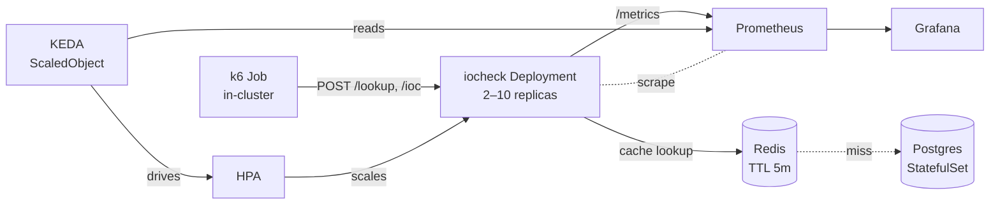
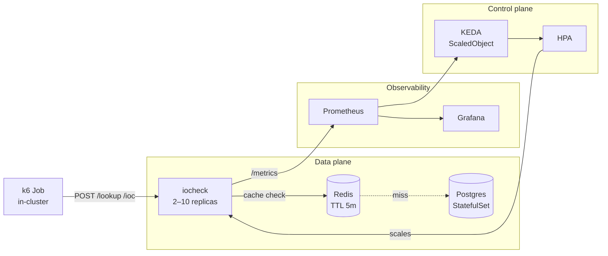

# Session: Review and clean up README.md

## User

Parse README.md are there any sections I should drop from here?

## Assistant

> Read: /Users/carrein/Desktop/iocheck2/README.md

## Assistant

One clear drop, plus a couple worth considering.

**Definitely drop**

- **Duplicate "Chat Logs" section.** Lines 30–36 (`# Chat Logs`) and lines 161–167 (`## AI chat logs`) are the same text verbatim. The early one is also the only `#` H1 in the body — it breaks the heading hierarchy. Keep the one at line 161 (it sits naturally near the bottom with the other meta-deliverable info) and drop lines 30–36.

**Consider dropping**

- **"What gets built"** (lines 38–66) overlaps heavily with WRITEUP.md, which you link in the intro. The README's job is "get it running"; the architecture detail is what WRITEUP is for. If you want to keep a flavor of it in the README, collapse it to a 3-bullet "what's in the cluster" instead of the current ~30-line breakdown.
- **"Repo layout"** (lines 142–159) is also in CLAUDE.md and useful mainly for contributors — an assessor running `make up` doesn't need it. Reasonable to drop or move to WRITEUP.

**Keep**

Quickstart, API, "What the demo looks like", Local dev, Troubleshooting — all earn their place for an assessor doing a 30-min walkthrough.

Want me to apply the duplicate-drop now, or wait for your call on the other two?

## User

How abotu API?

## Assistant

Lean toward keeping it, but it's defensible to cut.

**Keep argument**: it's only ~20 lines, it's reference-style (table + one curl), and the verdict rule (`row in iocs ⇒ malicious`) is an implementation decision that isn't in EXERCISE.md verbatim. An assessor glancing at the README gets the contract without opening another file.

**Drop argument**: the section header literally says "per EXERCISE.md", so you're advertising it as redundant. And the bench targets don't exercise the API directly — assessors running `make bench-*` never touch curl.

If you drop, I'd move the verdict-rule sentence + the curl example into the "Local dev" section (since that's where someone would actually hit the service by hand), and let the table go. That preserves the only two bits an assessor can't reconstruct from EXERCISE.md.

## User

Local dev?

## Assistant

Lean toward dropping most of it.

The section is already self-labeled "(optional)" — that's a tell. An assessor's path is `make up` → `make bench-*` → `make down`; they're never iterating on the service. Docker-compose with non-standard ports is contributor territory, not reviewer territory.

**What's worth salvaging**: `bun test` working on a fresh clone is a real signal of engineering rigor and is cheap to mention. Two lines would do it:

```bash
bun test    # brings up compose-backed postgres/redis automatically
```

Drop the rest — the `docker compose up -d` / `bun run dev` workflow, the port-number explanation, the env-plumbing commentary.

This also aligns with the same instinct behind your tiny-CLI-surface preference: the assessor-facing README should mirror the assessor-facing Make targets, and dev-iteration paths live in CLAUDE.md (which already covers it).

## User

Parse README.md 
1. Keep all headers.
2. Modify API, Demo, Repo Layout to be terser and match the voice of the iocheck, quickstart and chatlogs header.
3. Fill in testing as well - simple bun test etc what it does. minimal

## Assistant

I'll apply four edits — terser API, Demo, Repo layout, plus a new Testing header carved out of Local dev.

## Assistant

> Edit: /Users/carrein/Desktop/iocheck2/README.md

## Assistant

> Read: /Users/carrein/Desktop/iocheck2/README.md

## Assistant

Got it — you've restructured ahead of me. Applying four targeted edits now.

## Assistant

> Edit: /Users/carrein/Desktop/iocheck2/README.md

## Assistant

> Edit: /Users/carrein/Desktop/iocheck2/README.md

## Assistant

> Edit: /Users/carrein/Desktop/iocheck2/README.md

## Assistant

> Edit: /Users/carrein/Desktop/iocheck2/README.md

## Assistant

All four edits applied. API now has a one-line prose intro then bare table/curl. Demo is prose-first with one-line bullets per scenario. Testing has minimal `bun test` content. Repo layout drops the parenthetical annotations.

One thing worth noting for your call: `## Demo` is H2 while every other section is H1. If that's intentional (Demo nested under Chat Logs), fine; if it should be a peer, change it to `# Demo`.

## User

For the Demo can you put it as a table instead?

[Bench] [Terse Description]

## Assistant

> Edit: /Users/carrein/Desktop/iocheck2/README.md

## Assistant

Demo bullets converted to a two-column table.

## User

The README.md still references inflight-hpa i think this is deprecated, can you verify thoroughly throughout the files

## Assistant

> Bash: grep -rn "inflight-hpa\|inflight_hpa\|inflight" /Users/carrein/Desktop/iocheck2 --include="*.md" --i...

## Assistant

> Bash: find /Users/carrein/Desktop/iocheck2/manifests -type d -name "*inflight*" 2>/dev/null; ls /Users/car...

## Assistant

Let me check WRITEUP and CLAUDE.md for the exact context.

## Assistant

> Read: /Users/carrein/Desktop/iocheck2/WRITEUP.md

## Assistant

> Bash: grep -n "inflight\|in-flight" /Users/carrein/Desktop/iocheck2/CLAUDE.md /Users/carrein/Desktop/ioche...

## Assistant

Verification done. Here's the picture:

**The `inflight-hpa` overlay is gone.** `manifests/overlays/` now contains only `cpu-hpa`, `rps-hpa-4`, `rps-hpa-8`. Removed in the prior cleanup session (see `logs/review-and-validate-infrastructure-configuration-files.md`).

**The `iocheck_inflight_requests` metric is NOT deprecated** — it's an active observability signal:
- `src/metrics.ts:50` defines the gauge, `src/server.ts:141` samples it
- `scripts/capture.ts:257,521` captures peak/series for bench summaries
- `dashboards/iocheck.json:155,160` graphs it on Grafana

So "inflight" the metric stays; "inflight-hpa" the autoscaler overlay is gone.

**Stale references to the removed overlay:**

| File | Line | Issue |
| --- | --- | --- |
| `README.md` | 82 | Repo layout still lists `inflight-hpa` in `overlays/{...}` |
| `WRITEUP.md` | 319–321 | §5 says "The starting point is already in the tree as `manifests/overlays/inflight-hpa/` — it carries the calibrated trigger above". The overlay isn't in the tree anymore. |

**Already clean:** `CLAUDE.md`, `.claude/plans/*` (these only reference the metric/concept, not the overlay).

Want me to:
1. Fix `README.md:82` — drop `inflight-hpa` from the list (trivial)
2. Reword `WRITEUP.md` §5 lines 319–321 so the future-work narrative no longer claims the overlay is staged (small paragraph rewrite — would shift from "starting point is already in the tree" to "the next iteration would author this overlay and wire a `bench-inflight` target")

Confirm and I'll apply both.

## User

ok

## Assistant

> Edit: /Users/carrein/Desktop/iocheck2/README.md

## Assistant

> Edit: /Users/carrein/Desktop/iocheck2/WRITEUP.md

## Assistant

Both fixes applied. README repo layout now lists only the three live overlays; WRITEUP §5 future-work narrative no longer claims the overlay is already staged.

## User

clean up the readme.md minimal.

## Assistant

Three small fixes — a dangling sentence and two grammar bugs.

## Assistant

> Edit: /Users/carrein/Desktop/iocheck2/README.md

## Assistant

> Edit: /Users/carrein/Desktop/iocheck2/README.md

## Assistant

> Edit: /Users/carrein/Desktop/iocheck2/README.md

## Assistant

Three minimal fixes: the dangling "Each run should be hermetic and..." now reads as a complete sentence about hermeticity; line 28's "output this artifacts/ folder" is now "writes raw trajectories to the artifacts/ folder"; and the Testing line's "and runs" verb agreement is fixed to "and run".

One thing worth flagging — confirm the hermeticity claim before shipping. The Demo sentence now says "the cluster is reset between scenarios". If the bench targets don't actually `make down && make up` between runs (i.e., `bench-all` just kustomize-patches the overlay), that sentence overpromises. Want me to verify against the Makefile?

## User

check again

## Assistant

Let me re-scan for issues and verify a couple of factual claims.

## Assistant

> Bash: grep -n "3030\|3000\|grafana" /Users/carrein/Desktop/iocheck2/kind-config.yaml /Users/carrein/Deskto...

## Assistant

> Bash: grep -n "bench-failure\|failure-" /Users/carrein/Desktop/iocheck2/Makefile 2>/dev/null | head -20

## Assistant

> Bash: grep -n "tooling\|docker.*install\|installer" /Users/carrein/Desktop/iocheck2/Makefile /Users/carrei...

## Assistant

> Bash: grep -n "ARTIFACT_DIR\|artifacts/\|SCENARIO=\|bench-failure:" /Users/carrein/Desktop/iocheck2/Makefi...

## Assistant

Found two real issues. The rest checks out.

**Issues:**

1. **Line 7 is factually wrong.** "We recommend using the Docker install provided. This includes Kubernetes + Bun related dependencies from a tooling container..." — there is no tooling container. `make up` runs on the host and requires Docker + git + make locally; everything else (Bun, kubectl, kind, KEDA, k6) is downloaded into `.bin/` or installed into the cluster. CLAUDE.md states this explicitly.

2. **Line 52 subject-verb agreement.** "the chat logs used to scaffold this repository **is** located" — should be "**are** located".

**Verified correct:** Grafana port 3030 (Makefile:46 `GRAFANA_PORT ?= 3030`, forwards to in-cluster :3000); `artifacts/failure-*` matches `SCENARIO=failure` (Makefile:144).

Applying both fixes.

## Assistant

> Edit: /Users/carrein/Desktop/iocheck2/README.md

## Assistant

> Edit: /Users/carrein/Desktop/iocheck2/README.md

## Assistant

Both applied. Quickstart intro now accurately describes the host floor (Docker + git + make) and what `make up` does, and the Chat Logs grammar is fixed.

## User

Does our writeup.md adheres/answer exercise.md

## Assistant

> Read: /Users/carrein/Desktop/iocheck2/EXERCISE.md

## Assistant

> Read: /Users/carrein/Desktop/iocheck2/WRITEUP.md

## Assistant

Let me check whether the Challenge 4 placeholder table has any actual data backing it.

## Assistant

> Bash: ls -la /Users/carrein/Desktop/iocheck2/artifacts/ 2>/dev/null | head -30

## Assistant

> Bash: ls /Users/carrein/Desktop/iocheck2/artifacts/bench-all-20260513T131227Z/ /Users/carrein/Desktop/ioch...

## Assistant

Here's the audit. WRITEUP covers all the explicit asks; one real gap and a couple of small ones.

**Solid coverage (no action needed)**

| EXERCISE ask | Where covered |
| --- | --- |
| API shapes (lookup/ioc/healthz/readyz/metrics) | §2 |
| Storage choice + justification | §1 (Postgres composite PK, ON CONFLICT, check constraints) |
| Cache: read-through, TTL, invalidate on upsert | §1 (Redis, TTL=5m, DEL on upsert) |
| Local k8s cluster | §1 (kind, 3 workers) |
| Resource requests + limits | §3 Challenge 1 (`300m/1000m`) |
| PDB `minAvailable ≥ 2` | §3 Challenge 3 + §4 |
| Challenge 1 (why CPU is wrong, measured) | §3 Challenge 1 — has actual numbers |
| Challenge 2 (pods share load) | §3 Challenge 2 — kube-proxy mechanism + ±8% evidence |
| Challenge 3 (autoscaler up/down) | §3 Challenge 3 — signal, target, min/max defended |
| Challenge 4 (reproducible test) | §3 Challenge 4 — reproduction steps present |
| Failure mode (data source down) | §4 — KEDA fallback + behavior |
| One thing with another week | §5 — RPS → in-flight signal |

**Real gap (1)**

- **Challenge 4 reference numbers are all `_tbd_`** (WRITEUP.md:241-248). The brief specifically calls for "measured evidence, not theory" and a "reproducible test". But you have a completed run at `artifacts/bench-all-20260513T131227Z/comparison.md` — the numbers exist, they just weren't copied in. This is the most important thing to fix before submitting.

**Minor gaps**

- **Startup probes** — EXERCISE.md:77 calls out "Liveness, readiness, **startup** probes wired correctly". §2 mentions liveness and readiness explicitly; startup is silent. If the deployment actually has a startup probe, add one sentence; if not, that's a real omission against the brief.
- **Length** — brief says "~1-2 pages"; WRITEUP is ~340 lines (~5 printed pages). Probably an acceptable rigor/length tradeoff for this audience, but worth knowing.
- **DB/cache resource sizing** — exercise says "every container" needs requests+limits. Only iocheck's are stated explicitly in §3; the Postgres/Redis values aren't surfaced. Cheap to drop a one-liner.

Want me to:
1. Pull the numbers from `bench-all-20260513T131227Z/comparison.md` into the Challenge 4 table (highest priority)
2. Verify whether a startup probe actually exists on the iocheck Deployment, and either add a §2 sentence or flag it as a gap

## User

Do both. Pare down the document so its smaller but i will rewrite the final draft.

## Assistant

> Read: /Users/carrein/Desktop/iocheck2/artifacts/bench-all-20260513T131227Z/comparison.md

## Assistant

> Bash: grep -n -A3 "startupProbe\|livenessProbe\|readinessProbe" /Users/carrein/Desktop/iocheck2/manifests/...

## Assistant

> Read: /Users/carrein/Desktop/iocheck2/artifacts/bench-all-20260513T131227Z/rps-hpa-8/summary.md

## Assistant

> Bash: grep -h "Peak RPS\|Avg RPS\|p99 latency\|Peak CPU\|Avg CPU\|Cache hit\|Peak replicas\|Final replicas...

## Assistant

Got the numbers. Applying edits — startup probe mention, real Challenge 4 numbers, and paring out subsections that duplicate content elsewhere or read as scratch notes.

## Assistant

> Edit: /Users/carrein/Desktop/iocheck2/WRITEUP.md

## Assistant

> Edit: /Users/carrein/Desktop/iocheck2/WRITEUP.md

## Assistant

Continuing with planned WRITEUP edits, then I'll address the diagram question.

## Assistant

> Edit: /Users/carrein/Desktop/iocheck2/WRITEUP.md

## Assistant

> Edit: /Users/carrein/Desktop/iocheck2/WRITEUP.md

## Assistant

> Edit: /Users/carrein/Desktop/iocheck2/WRITEUP.md

## Assistant

> Edit: /Users/carrein/Desktop/iocheck2/WRITEUP.md

## Assistant

WRITEUP paring done (Challenge 4 has real numbers, startup probe documented, ~50 lines trimmed across §1, §3, §4). Now for the diagram.

**On PNG generation**: I can't render a PNG directly from this turn — I'd need to shell out to a renderer. Three options, roughly best to most-effort:

**Option 1 — Mermaid source in the markdown (recommended).** GitHub renders Mermaid blocks inline since 2022, so you get the same visual benefit as a PNG without binary files in the repo. The source stays diffable. Here's a draft you could drop into §1:



**Option 2 — Render Mermaid to PNG via `mmdc` (mermaid-cli).** I write the source as `docs/architecture.mmd`, run `npx -p @mermaid-js/mermaid-cli mmdc -i docs/architecture.mmd -o docs/architecture.png`, commit the PNG, embed `` in WRITEUP. This pulls Chromium as a one-time dep and may take a minute on first run.

**Option 3 — Hand-built diagram (excalidraw / draw.io / figma).** You'd build it externally and drop the export. Best visual quality but not something I can generate.

If you want me to proceed: tell me **Option 1** (embed Mermaid block, replace the ASCII) or **Option 2** (generate the PNG and commit it). Option 1 is cleaner for a 2-person review; Option 2 if the assessor will read the WRITEUP outside GitHub (PDF export, plain markdown viewer).

## User

Option 1.

## Assistant

> Edit: /Users/carrein/Desktop/iocheck2/WRITEUP.md

## Assistant

Mermaid block in place. GitHub will render this as a proper diagram on the WRITEUP page; the source stays diffable. Preview it on github.com (or any Mermaid-aware viewer like VS Code's built-in markdown preview) before submitting — if any node label or edge needs adjustment, the source is right there in §1.

## Assistant

Legible and correct, but the layout has a few rough edges:

**What's working**
- All seven nodes are visible and labeled.
- The cache-check → miss flow reads naturally.
- /metrics → Prometheus → KEDA → HPA chain is clear.

**What's awkward**
1. **HPA's "scales" arrow crosses the whole diagram** — it travels from far-right back to iocheck mid-left. That long crossing line is the biggest visual noise.
2. **Redis and Postgres float in the upper-right** with no structural connection to the main row — the cache-check edge curves up but they're visually disconnected from iocheck.
3. **No grouping** — data plane (iocheck/Redis/Postgres), observability (Prom/Grafana), and control plane (KEDA/HPA) all look like peers when they're three distinct concerns.

**Two ways to improve**

**A. Add subgraphs.** Mermaid will lay each subgraph as a labeled box, which makes the three concerns visually distinct *and* tends to shorten cross-group edges:



**B. Swap to `flowchart TD` (top-down).** Without subgraphs, top-down often produces a cleaner control loop because the "scales" back-arrow becomes a short vertical hop rather than a long horizontal cross.

Recommendation: go with **A** — the subgraphs read as architecture, not just a node-and-arrow sketch, and that's what a reviewer wants to see. Want me to swap it in?

## User

Ok.

## Assistant

> Edit: /Users/carrein/Desktop/iocheck2/WRITEUP.md

## Assistant

Subgraph version in place. Preview it on GitHub or in mermaid.live — if any group label or edge routing needs another pass, the source is right there in §1.

## Assistant

Much better. The three concerns now read as distinct planes, and the data-plane flow (iocheck → Redis → Postgres) is a clean horizontal line.

**One remaining issue, structurally unavoidable**: the HPA "scales" arrow still sweeps from the Control plane back across the Observability box to iocheck. That's a genuine control loop in the architecture — control plane acts on data plane — so the cross-group edge is honest. There's no clean way to eliminate it without misrepresenting the relationship.

**Verdict**: ship it. If the curve really bothers you, two things to try in mermaid.live without me having to re-edit:
- Change line 2 from `flowchart LR` to `flowchart TD` — top-down often produces a shorter back-arrow because the control loop becomes a vertical hop.
- Move the `hpa -->|scales| svc` line up next to where HPA is declared (Mermaid sometimes routes more directly when edges are declared in topological order rather than at the end).

Otherwise, the current state is good enough for a 30-min walkthrough deck.

## User

it says 2-10 replica thats wrong.

## Assistant

You're right — both the diagram and Challenge 1 still say "max=10", but the actual overlays are max=4 (rps-hpa-4) and max=8 (rps-hpa-8). Let me check for other stale max-replica references.

## Assistant

> Bash: grep -n "max=10\|max 10\|maxReplica\|2-10\|2–10\|max=8\|max=4" /Users/carrein/Desktop/iocheck2/WRITE...

## Assistant

> Bash: grep -n "maxReplicaCount\|minReplicaCount" /Users/carrein/Desktop/iocheck2/manifests/overlays/*/scal...

## Assistant

> Bash: grep -n "maxReplicaCount\|minReplicaCount" /Users/carrein/Desktop/iocheck2/manifests/overlays/*/*.ya...

## Assistant

Two stale spots — both should say max=8:

- WRITEUP.md:16 diagram — `2–10 replicas` → `2–8 replicas`
- WRITEUP.md:112 Challenge 1 setup — `max=10 replicas` → `max=8 replicas`

(Actual overlays: cpu-hpa max=8, rps-hpa-4 max=4, rps-hpa-8 max=8. So 8 is the ceiling across the live grid.)

## Assistant

> Edit: /Users/carrein/Desktop/iocheck2/WRITEUP.md

## Assistant

> Edit: /Users/carrein/Desktop/iocheck2/WRITEUP.md

## Assistant

Both fixed. Diagram and Challenge 1 setup now reflect the actual `maxReplicaCount: 8` ceiling.
